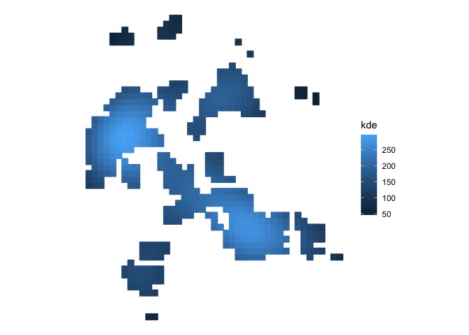

<!-- README.md is generated from README.Rmd. Please edit that file -->

# sfhotspot 

<!-- badges: start -->

[](https://CRAN.R-project.org/package=sfhotspot)
[](https://github.com/mpjashby/sfhotspot/actions)
[](https://app.codecov.io/gh/mpjashby/sfhotspot)
[](https://lifecycle.r-lib.org/articles/stages.html#stable)
<!-- badges: end -->

sfhotspot provides functions to identify and understand clusters of
points (typically representing the locations of places or events). All
the functions in the package work on and produce [simple
features](https://r-spatial.github.io/sf/) (SF) objects, which means
they can be used as part of modern spatial analysis in R.

## Installation

You can install the development version of sfhotspot from
[GitHub](https://github.com/) with:

``` r
# install.packages("remotes")
remotes::install_github("mpjashby/sfhotspot")
```

## Functions

sfhotspot has the following functions. All can be used by just supplying
an SF object containing points, or can be configured using the optional
arguments to each function.

| name                 | use                                                                                                                                                                                                                                      |
|:---------------------|:-----------------------------------------------------------------------------------------------------------------------------------------------------------------------------------------------------------------------------------------|
| `hotspot_count()`    | Count the number of points in each cell of a regular grid. Cell size can be set by the user or chosen automatically.                                                                                                                     |
| `hotspot_change()`   | Measure the change in the count of points in each cell between two periods of time.                                                                                                                                                      |
| `hotspot_kde()`      | Estimate kernel density for each cell in a regular grid. Cell size and bandwidth can be set by the user or chosen automatically.                                                                                                         |
| `hotspot_dual_kde()` | Compare the kernel density of two layers of points, e.g. to estimate the local risk of an event occurring relative to local population.                                                                                                  |
| `hotspot_gistar()`   | Calculate the Getis–Ord $G_i^*$ statistic for each cell in a regular grid, while optionally estimating kernel density. Cell size, bandwidth and neighbour distance can be set by the user or chosen automatically.                       |
| `hotspot_classify()` | Classify grid cells according to whether they have had significant clusters of points at different time periods. All parameters can be chosen automatically or be set by the user using the `hotspot_classify_params()` helper function. |

The results produced by `hotspot_count()`, `hotspot_change()`,
`hotspot_kde()`, `hotspot_dual_kde()` and `hotspot_classify()` can be
easily plotted using included methods for`autoplot()` and `autolayer()`.

There are also included datasets:

- `memphis_robberies`, containing records of 2,245 robberies in Memphis,
  TN, in 2019.
- `memphis_robberies_jan`, containing the same data but only for the 206
  robberies recorded in January 2019.
- `memphis_population`, containing population counts for the centroids
  of 10,393 census blocks in Memphis, TN, in 2020.

## Example

We can use the `hotspot_gistar()` function to identify cells in a
regular grid in which there are more/fewer points than would be expected
if the points were distributed randomly. In this example, the points
represent the locations of personal robberies in Memphis, which is a
dataset included with the package.

``` r
# Load packages
library(sf)
#> Linking to GEOS 3.11.0, GDAL 3.5.3, PROJ 9.1.0; sf_use_s2() is TRUE
library(sfhotspot)
library(tidyverse)
#> ── Attaching core tidyverse packages ──────────────────────── tidyverse 2.0.0 ──
#> ✔ dplyr     1.1.2     ✔ readr     2.1.4
#> ✔ forcats   1.0.0     ✔ stringr   1.5.0
#> ✔ ggplot2   3.4.3     ✔ tibble    3.2.1
#> ✔ lubridate 1.9.2     ✔ tidyr     1.3.0
#> ✔ purrr     1.0.2
#> ── Conflicts ────────────────────────────────────────── tidyverse_conflicts() ──
#> ✖ dplyr::filter() masks stats::filter()
#> ✖ dplyr::lag()    masks stats::lag()
#> ℹ Use the conflicted package (<http://conflicted.r-lib.org/>) to force all conflicts to become errors


# Transform data to UTM zone 15N so that we can think in metres, not decimal 
# degrees
memphis_robberies_utm <- st_transform(memphis_robberies, 32615)


# Identify hotspots, set all the parameters automatically by not specifying cell 
# size, bandwidth, etc.
memphis_robberies_hotspots <- hotspot_gistar(memphis_robberies_utm)
#> Cell size set to 500 metres automatically
#> Bandwidth set to 5,592 metres automatically based on rule of thumb
#> The legacy packages maptools, rgdal, and rgeos, underpinning the sp package,
#> which was just loaded, will retire in October 2023. Please refer to R-spatial
#> evolution reports for details, especially
#> https://r-spatial.org/r/2023/05/15/evolution4.html. It may be desirable to make
#> the sf package available; package maintainers should consider adding sf to
#> Suggests:. The sp package is now running under evolution status 2 (status 2
#> uses the sf package in place of rgdal)
#> Done: [--------------------------------------------------------------------] .Done: [======================================------------------------------] .Done: [=======================================-----------------------------] .Done: [========================================----------------------------] .Done: [=========================================---------------------------] .Done: [==========================================--------------------------] .Done: [===========================================-------------------------] .Done: [============================================------------------------] .Done: [=============================================-----------------------] .Done: [==============================================----------------------] .Done: [===============================================---------------------] .Done: [================================================--------------------] .Done: [=================================================-------------------] .Done: [==================================================------------------] .Done: [===================================================-----------------] .Done: [====================================================----------------] .Done: [=====================================================---------------] .Done: [======================================================--------------] .Done: [=======================================================-------------] .Done: [========================================================------------] .Done: [=========================================================-----------] .Done: [==========================================================----------] .Done: [===========================================================---------] .Done: [============================================================--------] .Done: [=============================================================-------] .Done: [==============================================================------] .Done: [===============================================================-----] .Done: [================================================================----] .Done: [=================================================================---] .Done: [==================================================================--] .Done: [===================================================================-] .Done: [====================================================================] .                                                                              


# Visualise the hotspots by showing only those cells that have significantly
# more points than expected by chance. For those cells, show the estimated
# density of robberies.
memphis_robberies_hotspots %>% 
  filter(gistar > 0, pvalue < 0.05) %>% 
  ggplot(aes(colour = kde, fill = kde)) +
  geom_sf() +
  scale_colour_distiller(aesthetics = c("colour", "fill"), direction = 1) +
  labs(title = "Density of robberies in Memphis, 2019") +
  theme_void()
```


