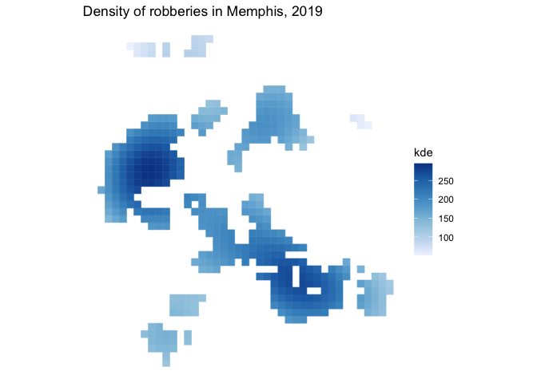

<!-- README.md is generated from README.Rmd. Please edit that file -->

# sfhotspot 

<!-- badges: start -->

[](https://CRAN.R-project.org/package=sfhotspot)
[](https://lifecycle.r-lib.org/articles/stages.html#experimental)
<!-- badges: end -->

sfhotspot provides functions to identify and understand clusters of
points (typically representing the locations of places or events). All
the functions in the package work on and produce [simple
features](https://r-spatial.github.io/sf/) (SF) objects, which means
they can be used as part of modern spatial analysis in R.

## Installation

You can install the development version of sfhotspot from
[GitHub](https://github.com/) with:

``` r
# install.packages("remotes")
remotes::install_github("mpjashby/sfhotspot")
```

## Example

We can use the `hotspot_gistar()` function to identify cells in a
regular grid in which there are more/fewer points than would be expected
if the points were distributed randomly. In this example, the points
represent the locations of personal robberies in Memphis, which is a
dataset included with the package.

``` r
# Load packages
library(sf)
#> Linking to GEOS 3.9.1, GDAL 3.2.3, PROJ 7.2.1
library(sfhotspot)
library(tidyverse)
#> ── Attaching packages ─────────────────────────────────────── tidyverse 1.3.1 ──
#> ✓ ggplot2 3.3.5     ✓ purrr   0.3.4
#> ✓ tibble  3.1.4     ✓ dplyr   1.0.7
#> ✓ tidyr   1.1.3     ✓ stringr 1.4.0
#> ✓ readr   2.0.1     ✓ forcats 0.5.1
#> ── Conflicts ────────────────────────────────────────── tidyverse_conflicts() ──
#> x dplyr::filter() masks stats::filter()
#> x dplyr::lag()    masks stats::lag()
# Transform data to UTM zone 15N so that we can think in metres, not decimal 
# degrees
memphis_robberies_utm <- st_transform(memphis_robberies, 32615)

# Identify hotspots, set all the parameters automatically by not specifying cell 
# size, bandwidth, etc.
memphis_robberies_hotspots <- hotspot_gistar(memphis_robberies_utm)
#> Cell size set to 500 metres automatically
#> Bandwidth set to 5,592.453 metres automatically based on rule of thumb
#> Using centroids instead of provided `grid` geometries to calculate KDE estimates.
# Visualise the hotspots by showing only those cells that have significantly
# more points than expected by chance. For those cells, show the estimated
# density of robberies.
memphis_robberies_hotspots %>% 
  filter(gistar > 0, pvalue < 0.05) %>% 
  ggplot(aes(colour = kde, fill = kde)) +
  geom_sf() +
  scale_colour_continuous(aesthetics = c("colour", "fill")) +
  theme_void()
```


